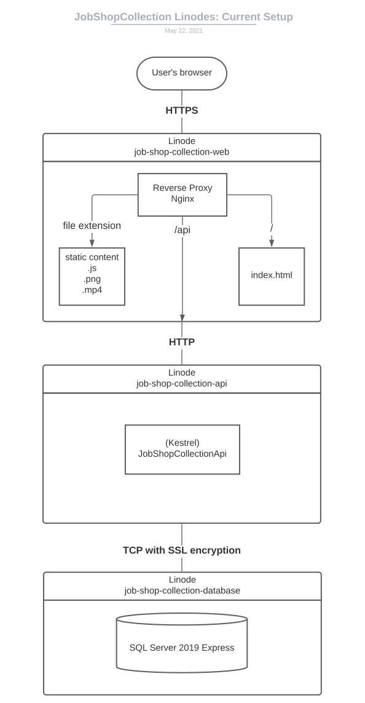
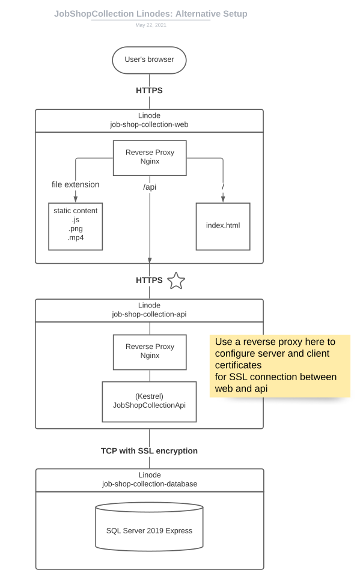

# job-shop-collection-api
API of the [Job Shop Collection website](https://job-shop-collection.michael-yin.net).

## How to run locally
1. Clone repo
2. Open job-shop-collection-api.sln in Visual Studio 2019 or above, with IIS Express and localDb installation
3. Create database with localDb
    1. In Package Manager Console
    2. Have `job-shop-collection-api` as startup project
    3. Have `job-shop-collection-api.Data` as default project of console
    4. Run `Update-Database`
4. Run (F5) with IIS Express

The api is now running locally, make calls e.g. with postman or browser to e.g.
```
GET http://localhost:55758/api/job-sets
```
Check /job-shop-collection-api/Properties/launchSettings.json for the URL.\
Check the controller for API endpoints and request/response format.

### Run locally with React app job-shop-collection-web

Serve the React app locally with `"proxy": "https://localhost:44383"` in `package.json`.

CORS is set to allow any origin in development, to prevent problems of serving API and react app separately.

## Deployment on Azure
The solution `job-shop-collection-api.sln` is hosted with Azure App Service job-shop-collection-api.

The database is hosted with Azure SQL Server job-shop-collection, Azure SQL Database job-shop-collection.

The connection string for API to connect to database is stored in Settings | Configuration | Connection strings.

### CORS
CORS is setup to allow `job-shop-collection-web`'s React app (hosted in a different origin) to make requests to the api.
- The static website primary endpoint and
- CDN endpoint
- azure.job-shop-collection.michael-yin.net

are added as allowed Origins 

### Manually update database on Azure
In powershell, run commands
```
dotnet tool install --global dotnet-ef

$Env:ConnectionStrings__JobShopCollectionConnectionString = "the connection string copied from azure protal"

dotnet ef database update --configuration Release -p job-shop-collection-api.Data -s job-shop-collection-api
```

Check the result with Azure Portal Query editor (preview), specifically the `__EFMigrationsHistory` table.

### Manually deploy API on Azure
Publish the project in Visual Studio, logged into Azure account.

### Continuous Deployment by Github Actions

Continuous deployment is setup using Azure App Service job-shop-collection-api's Deployment center. It adds the publish profile to Github repository secret, and adds a Github Actions workflow. The workflow yml file was modified to add an update database step.

Added the connection string to Github repository secret, for updating database during deployment.

You can check the deployment log on Azure portal or on Github.

### Deployment Steps
1. Build
2. Update Azure SQL Database
3. Deploy Azure App Service

These 3 steps runs sequentially and will not run if a previous step failed. Therefore it is possible to have the database updated but API not deployed.

Database update of each deployment should be backwards compatible, otherwise there should be a downtime to ensure the database and API are both updated. 

I created a manually-triggered Github Actions workflow to revert the database to a specific migration.

<details>
    <summary>Revert Database Migrations</summary>
    Should first run the workflow that has <code>Update-Database {target-migration}</code>, so that the <code>Down()</code> part of the migrations are executed. Then remove the migration in the next commit.<br>
    Another option is not revert the migration, and add a new migration that does the inverse.
</details>

#### Generate azure credential for github actions secret
The Azure SQL server and database's firewall is open to public, so a service principal is not needed, and do not need to login to Azure. However if one is needed, here is the command to create the service principal.
In Azure CLI
```
az ad sp create-for-rbac --sdk-auth --name "job-shop-collection-database-publisher" --role contributor --scopes /subscriptions/d1fef207-a33e-4536-bead-9ab97bbf6001/resourceGroups/JobShopCollectionResourceGroup/providers/Microsoft.Sql/servers/job-shop-collection
```
Save the output json as `AZURE_CREDENTIALS_DATABASE_PUBLISHER` in Github repository secrets.

## Hosted on Linode
The solution `job-shop-collection-api.sln` is hosted with on a Linode job-shop-collection-api.

The database is hosted with SQL Server 2019 Express Edition on a Linode job-shop-collection-database.



<details>
<Summary>Alternative Setup (Not in use)</summary>
To have HTTPS between web and api, we could add a Nginx reverse proxy in front of the Api application, so that it is easy to configure SSL certificates in Nginx configurations.

Using Nginx would be easier than configuring the certificates in the application, and keep the Api application's Kestrel Server as the public facing Edge Server.



### SSL certificate for https from reverse proxy to api server
1. generate rootCA.key
```
openssl genrsa -out rootCA.key 4096
```

2. generate rootCA.crt
```
openssl req -x509 -new -nodes -key rootCA.key -sha256 -days 36500 -out rootCA.crt
```

3. generate webproxy.key
```
openssl genrsa -out webproxy.key 2048
```

4. generate webproxy.csr
```
openssl req -new -key webproxy.key -out webproxy.csr
```
with `job-shop-collection.michael-yin.net` as Common Name

5. generate webproxy.crt
```
openssl x509 -req -in webproxy.csr -CA rootCA.crt -CAkey rootCA.key -CAcreateserial -out webproxy.crt -days 36500 -sha256
```

6. generate api.key
```
openssl genrsa -out api.key 2048
```

7. generate api.csr
```
openssl req -new -key api.key -out api.csr
```
with `job-shop-collection.michael-yin.net` as Common Name

8. generate api.crt
```
openssl x509 -req -in api.csr -CA rootCA.crt -CAkey rootCA.key -CAcreateserial -out api.crt -days 36500 -sha256
```
</details>

### Setup job-shop-collection-database Linode
- https://www.linode.com/docs/guides/getting-started/
    - Skip hostname and host file
- https://www.linode.com/docs/guides/securing-your-server/
- https://docs.microsoft.com/en-us/sql/linux/quickstart-install-connect-ubuntu?view=sql-server-ver15
    - Follow through and install SQL Server 2019, choose express edition when asked
- https://stackoverflow.com/questions/1601186/sql-server-script-to-create-a-new-user\
    - Add user

Some commnads
```
// check status
systemctl status mssql-server --no-pager

// allow port in firewall
sudo ufw allow 1433

// check the network connection
nc -zv YOUR_SERVER_NAME_OR_IP 1433

// enter sql command mode for that user, and specify to use job-shop-collection database
sqlcmd -S . -U SA -P '<YourPassword>'
use [job-shop-collection]
```

The connection string is
```
Data Source=tcp:192.53.169.244,1433;Initial Catalog=job-shop-collection;Persist Security Info=False;User ID=jobshopadmin;Password={your_password};MultipleActiveResultSets=False;Encrypt=True;TrustServerCertificate=True;Connection Timeout=30;
```

#### Update database
The database is updated with the connection string. New migrations committed are continuously deployed in the Github Action of Linode job-shop-collection-api.

### Setup job-shop-collection-api Linode
